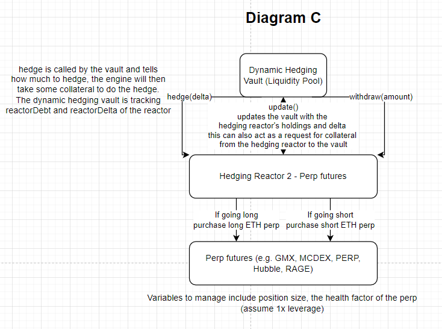
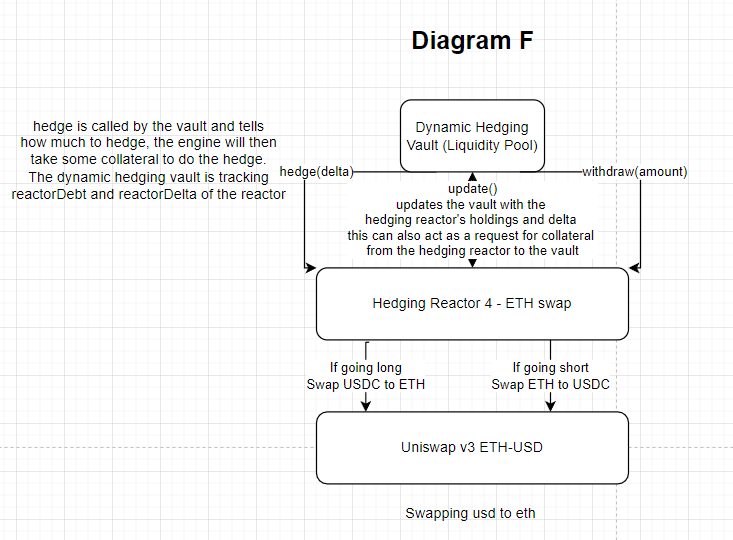

<br />
<p align="center">
  <a href="https://github.com/github_username/repo_name">
    
  </a>

  <h3 align="center">Dynamic hedging</h3>

  <p align="center">
     Options delta neutrality as a crypto native uncorrelated asset class
    <br />
  </p>
</p>

## Getting Started

To get a local copy up and running follow these simple steps.

### Prerequisites

At Rysk, we use Yarn for package management with Yarn workspaces. To get started with Yarn if you haven't installed it yet, you can run:

```sh
npm install --global yarn
```

We use jq for formatting JSON files from the command line. To install it, you might have to run:

```sh
$ sudo apt-get install jq
```

### Installation

1. Clone the repo

    ```sh
    git clone
    ```

2. Install packages

    ```sh
    yarn
    ```

3. Add environment variables

    You will need to create free API keys for Alchemy and Infura. You can then:

    - Create `/packages/contracts/.env`
    - Add `ALCHEMY=<your-alchemy-key>`
    - Create `/packages/front-end/.env`
    - Add `REACT_APP_INFURA_KEY=<your-infura-key>`

4. Compile contracts

    ```sh
    yarn workspace contracts compile
    ```

5. Deploy contracts and update ABIs + address

    ```sh
    yarn workspace contracts deploy:localhost
    ```

6. Start the front end

    ```sh
    yarn workspace front-end start
    ```

    It will become accessible on http://localhost:3000

## Usage examples

### Testing Contracts

Complete steps 1 to 3 from the installation section and then:

1. Compile all files

    ```sh
    yarn workspace contracts compile
    ```

2. Run all tests

    ```sh
    yarn workspace contracts test
    ```

    To run a specific test suite, e.g. `LiquidityPool.ts`

    ```sh
    yarn workspace contracts test test/LiquidityPool.ts
    ```

    Run test coverage

    ```sh
    yarn workspace contracts test-coverage
    ```

## Contract Architecture





## Contract layout

```bash
contracts
├── hedging
│   ├── PerpHedgingReactor.sol
│   └── UniswapV3HedgingReactor.sol
├── interfaces
│   ├── AddressBookInterface.sol
│   ├── IAuthority.sol
│   ├── AggregatorV3Interface.sol
│   ├── GammaInterface.sol
│   ├── IERC20.sol
│   ├── IOptionRegistry.sol
│   ├── ILiquidityPool.sol
│   ├── IHedgingReactor.sol
│   ├── IMarginCalculator.sol
│   └── IOracle.sol
├── libraries
│   ├── BlackScholes.sol
│   ├── CustomErrors.sol
│   ├── NormalDist.sol
│   ├── OptionsCompute.sol
│   ├── OpynInteractions.sol
│   ├── AccessControl.sol
│   ├── SafeTransferLib.sol
│   └── Types.sol
├── tokens
│   └── ERC20.sol
├── Authority.sol
├── LiquidityPool.sol
├── OptionRegistry.sol
├── OptionHandler.sol
├── Protocol.sol
├── PortfolioValuesFeed.sol
├── VolatilityFeed.sol
└── PriceFeed.sol
```
